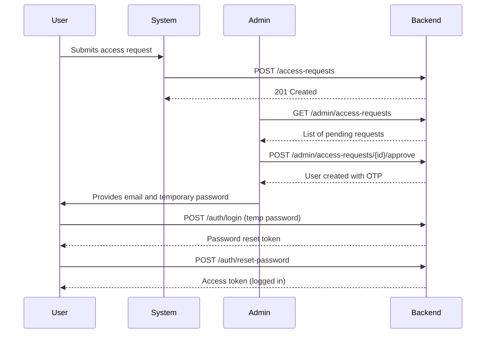

# One-Time Password (OTP) Implementation Summary

## Overview
This document summarizes the complete implementation of the one-time password feature for new user onboarding. The system allows administrators to generate unique, single-use passwords for new users, who must then change their password on first login.

## Architecture Changes

### 1. Database Schema Updates
**File:** `backend/app/models/user.py`

- Added `must_change_password: bool = False` field to `UserInDB` model
- Added `must_change_password: bool = False` field to `UserPublic` model  
- Added `must_change_password: Optional[bool] = None` field to `UserUpdate` model
- Created new models:
  - `AdminUserCreate`: For admin user creation requests
  - `UserWithOTP`: Returns user data with temporary password
  - `PasswordResetToken`: For password reset tokens
  - `PasswordResetRequest`: For password reset requests

### 2. Authentication Service Updates
**File:** `backend/app/services/auth_service.py`

New functions added:
- `generate_temporary_password()`: Generates secure 12-character passwords
- `create_user_with_otp()`: Creates users with temporary passwords
- `create_password_reset_token()`: Creates short-lived reset tokens (15 min expiry)
- `verify_password_reset_token()`: Validates reset tokens
- `reset_password()`: Handles password resets and clears must_change_password flag
- `get_current_admin_user()`: Dependency for admin-only endpoints

### 3. Authentication Router Updates
**File:** `backend/app/routers/auth.py`

- **Modified `/auth/login`**: Now checks `must_change_password` flag and returns reset token instead of access token when password change is required
- **Added `/auth/reset-password`**: Handles password resets and returns access token
- **Added `/admin/users/create`**: Admin-only endpoint for creating users with OTP
- **Modified `/auth/register`**: Now requires admin authentication (disabled public registration)

### 4. Access Request System
**Files:** 
- `backend/app/models/access_request.py`
- `backend/app/services/access_request_service.py`
- `backend/app/routers/access_requests.py`

New system for handling user access requests:
- **Public endpoint** `/access-requests`: Users can submit access requests
- **Admin endpoints**:
  - `GET /admin/access-requests`: View all requests (with optional status filter)
  - `GET /admin/access-requests/{id}`: View specific request
  - `PATCH /admin/access-requests/{id}`: Update request status/notes
  - `POST /admin/access-requests/{id}/approve`: Approve request and create user with OTP

## API Endpoints

### Public Endpoints
- `POST /api/v1/access-requests` - Submit access request
- `POST /api/v1/auth/login` - Login (returns reset token if password change required)
- `POST /api/v1/auth/reset-password` - Reset password with token

### Admin-Only Endpoints
- `POST /api/v1/admin/users/create` - Create user with OTP
- `GET /api/v1/admin/access-requests` - View access requests
- `POST /api/v1/admin/access-requests/{id}/approve` - Approve and create user
- `POST /api/v1/auth/register` - Registration (now admin-only)

## User Flow

### Complete User Onboarding Flow



### Administrator Workflow
1. Admin receives notification of new access request
2. Admin reviews request details (email, name, reason, organization)
3. Admin approves request via `/admin/access-requests/{id}/approve`
4. System creates user and returns temporary password
5. Admin securely communicates credentials to new user

### New User Workflow
1. User submits access request via public form
2. User receives temporary credentials from administrator
3. User logs in with temporary password
4. System forces password reset (returns reset token, not access token)
5. User sets new password via reset endpoint
6. User gains full access to the system

## Security Features

- **Temporary passwords**: 12-character secure random passwords
- **Short-lived reset tokens**: 15-minute expiry for password reset tokens
- **Forced password change**: Users cannot access system until password is changed
- **Admin-only user creation**: Public registration is disabled
- **Secure password hashing**: Using bcrypt for all password storage
- **JWT token validation**: Proper token verification for all protected endpoints

## Testing

### Test Scripts Created
1. `backend/test_otp_implementation.py` - Basic OTP flow testing
2. `backend/test_complete_otp_flow.py` - Complete flow including access requests

### Test Coverage
- ✅ Access request submission
- ✅ Admin approval workflow
- ✅ User creation with OTP
- ✅ Login with temporary password
- ✅ Forced password reset
- ✅ Normal login after password change
- ✅ Protected endpoint access

## Database Collections

### Users Collection
```javascript
{
  id: "uuid",
  email: "user@example.com",
  hashed_password: "bcrypt_hash",
  role: "user|admin",
  status: "active|inactive|suspended",
  is_premium: false,
  must_change_password: true, // NEW FIELD
  invitation_id: "uuid|null",
  created_at: "datetime",
  last_login: "datetime|null"
}
```

### Access Requests Collection (NEW)
```javascript
{
  id: "uuid",
  email: "user@example.com",
  full_name: "User Name",
  reason: "Access reason",
  organization: "Company Name",
  status: "pending|approved|rejected",
  created_at: "datetime",
  processed_at: "datetime|null",
  processed_by: "admin_uuid|null",
  admin_notes: "Admin comments"
}
```

## Configuration Requirements

### Environment Variables
No new environment variables required. Uses existing:
- `SECRET_KEY` - For JWT token signing
- `ALGORITHM` - JWT algorithm (default: HS256)
- `ACCESS_TOKEN_EXPIRE_MINUTES` - Token expiry time

### Dependencies
All required dependencies already present:
- `fastapi` - Web framework
- `python-jose` - JWT handling
- `passlib` - Password hashing
- `bcrypt` - Password hashing algorithm
- `pydantic` - Data validation

## Deployment Notes

1. **Database Migration**: The `must_change_password` field will default to `False` for existing users
2. **Admin Setup**: Ensure at least one admin user exists before deployment
3. **Frontend Updates**: Login page needs to handle password reset flow
4. **Access Request Form**: New public form needed for access requests

## Future Enhancements

1. **Email Notifications**: Automatic email notifications for access requests and approvals
2. **Password Expiry**: Configurable temporary password expiration
3. **Bulk User Creation**: CSV import for multiple users
4. **Access Request Templates**: Pre-defined request categories
5. **Audit Logging**: Track all admin actions and user activities

## Files Modified/Created

### Modified Files
- `backend/app/models/user.py`
- `backend/app/services/auth_service.py`
- `backend/app/routers/auth.py`
- `backend/app/main.py`

### New Files
- `backend/app/models/access_request.py`
- `backend/app/services/access_request_service.py`
- `backend/app/routers/access_requests.py`
- `backend/test_otp_implementation.py`
- `backend/test_complete_otp_flow.py`
- `backend/OTP_IMPLEMENTATION_SUMMARY.md`

## Implementation Status: ✅ COMPLETE

The one-time password feature has been fully implemented and tested. The system is ready for production deployment with proper admin user setup and frontend integration.